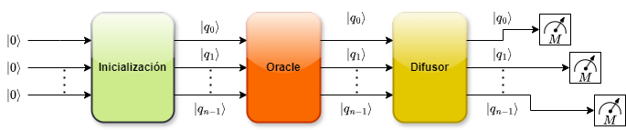

# **Práctica de Laboratorio No. 3**  
## **Algoritmo de Grover para Búsqueda Cuántica**

---

## **Objetivo**

Analizar en implementar una versión modular del **algoritmo de Grover** mediante su programación en **Qiskit**, comprendiendo su funcionamiento y la importancia del número de iteraciones requeridas en su ejecución.

---

## **Introducción**

El algoritmo de Grover permite encontrar un elemento marcado dentro de un conjunto no ordenado de tamaño $N$ con una complejidad de $O(\sqrt{N})$, ofreciendo una mejora cuadrática frente a los métodos en computación clásica o convencional.

---

## **Instrucciones**

Considere el siguiente tutorial introductorio sobre el algoritmo de Grover:

🔗 https://quantum.cloud.ibm.com/learning/en/courses/utility-scale-quantum-computing/grovers-algorithm

A partir de este recurso, desarrolle las siguientes actividades:

---

## **Actividades**

### **1. Extensión para $n$ qubits**
- Analice el siguiente Notebook, el cual presenta una mejora con relación al tutorial anterior extendiendo dicho Algoritmo de Grover para el caso de **$n$ qubits**.

  🔗 https://github.com/gpatigno/QC_2026/blob/main/PR3/N-Grover_AnyMark_2026.ipynb

- Descargue este Notebook, y ejecute su simulación para **2 qubits**.
- Compare dicha ejecución con aquella presentada en el tutorial original de **Qiskit**.

---

### **2. (40%) Modularización del circuito**
Modifique el Notebook para construir una versión **modular** del algoritmo de Grover:

- Organice el circuito cuántico en bloques funcionales.  
- Asegúrese de que la implementación corresponda al siguiente esquema:

    

    **Figura 1.** Circuito del Algoritmo de Grover dividido en bloques.

---

### **3. (20%) Iteraciones del algoritmo**
- En su nuevo código implemente una manera de calcular **automáticamente** el número $k$ de iteraciones del operador de Grover **(Oracle * Difusor)**.

  $$k \approx \frac{\pi}{4} \sqrt{2^n}$$

- Ejecute su simulación para **3 qubits** y compare los resultados con aquellos presentados en el tutorial original de **Qiskit**.

---

### **4. (20%) Experimentos con diferentes tamaños**
Realice pruebas con distintos valores de **$n$**:

- \( n = 4 \)
- \( $n \geq 5$ \)

Para cada caso, reporte:

- Estado marcado.  
- Número de iteraciones resultantes.
- Distribución de probabilidades final.
- Probabilidad de éxito.

---

## **5. (20%) Documentación del código**

- Incluya comentarios propios en español.
- Justifique cada parte del circuito:

  - Oracle  
  - Difusor  
  - Iteraciones  

- En la definición del bloque del Oracle, explique cómo este circuito modifica la fase del estado buscado (estado marcado).
- Igualmente, en la definición del bloque del difusor, explique como se lleva a cabo la _inversión sobre la media_: 

  $$2\ket{\psi}\bra{\psi}-I$$

---
---

### **6. Ejecución en hardware cuántico real**
- Habilite el acceso a los QPU de IBM mediante su cuenta de **IBM Cloud**.  
- Ejecute el circuito en un QPU de **al menos 127 qubits**.

---

### **7. Ejecución en hardware cuántico real**
- Ejecute el circuito en un QPU real de IBM.
- Compare los resultados con los obtenidos en simulador.

---

### **7. Resultados en QPU real**
Reporte:

- **Job ID** del circuito ejecutado.
- Estado objetivo  
- Número de iteraciones  
- Resultados medidos  
- Probabilidad de éxito  
- Comparación con simulador  

---

## **Entrega de la actividad**

Complete la entrega a través del siguiente formulario:

📎 [Formulario de entrega](https://forms.gle/LBEeAGqRTGv1g2uW6)

### **Elementos requeridos:**

- Enlace al **Notebook en Google Colab o Github** con el código desarrollado.
- Respuestas a las preguntas planteadas en cada ejercicio.  