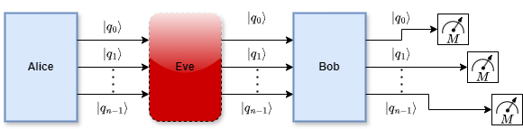

# **Práctica de Laboratorio No. 3**  
## **Quantum Key Distribution (QKD)**

---

## **Objetivo**

Analizar en implementar una versión modular del protocolo de **Distribución Cuántica de Claves (QKD)** en presencia de un espía (_eavesdropper_), mediante su programación en **Qiskit**.

---

## **Instrucciones**

Considere el **Experimento 2** del siguiente tutorial, el cual aborda la implementación del protocolo QKD con un espía:

🔗 [**Experiment 2**: QKD with an eavesdropper](https://quantum.cloud.ibm.com/learning/en/modules/computer-science/quantum-key-distribution#experiment-2-qkd-with-an-eavesdropper)

A partir de este recurso, desarrolle las siguientes actividades:

---

## **Actividades**

### **1. Extracción del código**
A partir del notebook original del tutorial:

- Extraiga únicamente el código correspondiente al **Experimento 2**.  
- Cree un **nuevo notebook** que contenga exclusivamente este código.

---

### **2. Verificación del funcionamiento**
- Ejecute el nuevo notebook.  
- Verifique que el protocolo QKD funciona correctamente de acuerdo con su comportamiento esperado.

---

### **3. (40%) Modularización del circuito**
Modifique el notebook para construir una versión **modular** del algoritmo:

- Organice el circuito cuántico en bloques funcionales.  
- Asegúrese de que la implementación corresponda al siguiente esquema:

    

    **Figura 1.** Circuito de QKD dividido en bloques.

---

### **4. (30%) Ejecución con n = 30 qubits**
Simule el circuito considerando **n = 30 qubits** y reporte los siguientes resultados:
- Bits aleatorios de Alice.  
- Bases aleatorias de Alice.  
- Bases aleatorias de Eve. 
- Bits medidos por Eve.  
- Bases aleatorias de Bob.  
- Bits medidos por Bob.  
- Clave binaria resultante luego de la confirmación de Alice y Bob de sus bases utilizadas.
- Se evidencia la presencia de un espía en la generación de la clave binaria? **Explique y justifique matemáticamente.**
- Indique el porcentaje de fidelidad obtenido.

---

### **5. (30%) Documentación del código**
- Elimine todos los comentarios originales del notebook.  
- Agregue comentarios propios en español.

En dichos comentarios:

- Justifique **cada modificación realizada**, incluso los cambios más pequeños.  
- Explique cómo estos cambios contribuyen a la construcción del circuito mostrado en la **Figura 1**.

---
---

### **6. Ejecución en hardware cuántico real**
- Habilite el acceso a los QPU de IBM mediante su cuenta de **IBM Cloud**.  
- Ejecute el circuito en un QPU de **al menos 127 qubits**.

---

### **7. Resultados en QPU real**
A partir de la ejecución en hardware real, reporte:

- **Job ID** del circuito ejecutado.
- Circuito resultante de la transpilación de su circuito de la **Figura 1**.  
- Bits aleatorios de Alice.  
- Bases aleatorias de Alice.  
- Bases aleatorias de Eve.  
- Bits medidos por Eve.  
- Bases aleatorias de Bob.  
- Bits medidos por Bob.  
- Nuevamante, se evidencia la presencia de un espía en la generación de la clave binaria? **Explique y justifique matemáticamente.**
- Cálculo del porcentaje de fidelidad.  

---

## **Entrega de la actividad**

Complete la entrega a través del siguiente formulario:

📎 [Formulario de entrega](https://forms.gle/LBEeAGqRTGv1g2uW6)

### **Elementos requeridos:**

- Enlace al **Notebook en Google Colab o Github** con el código desarrollado.
- Respuestas a las preguntas planteadas en cada ejercicio.  

